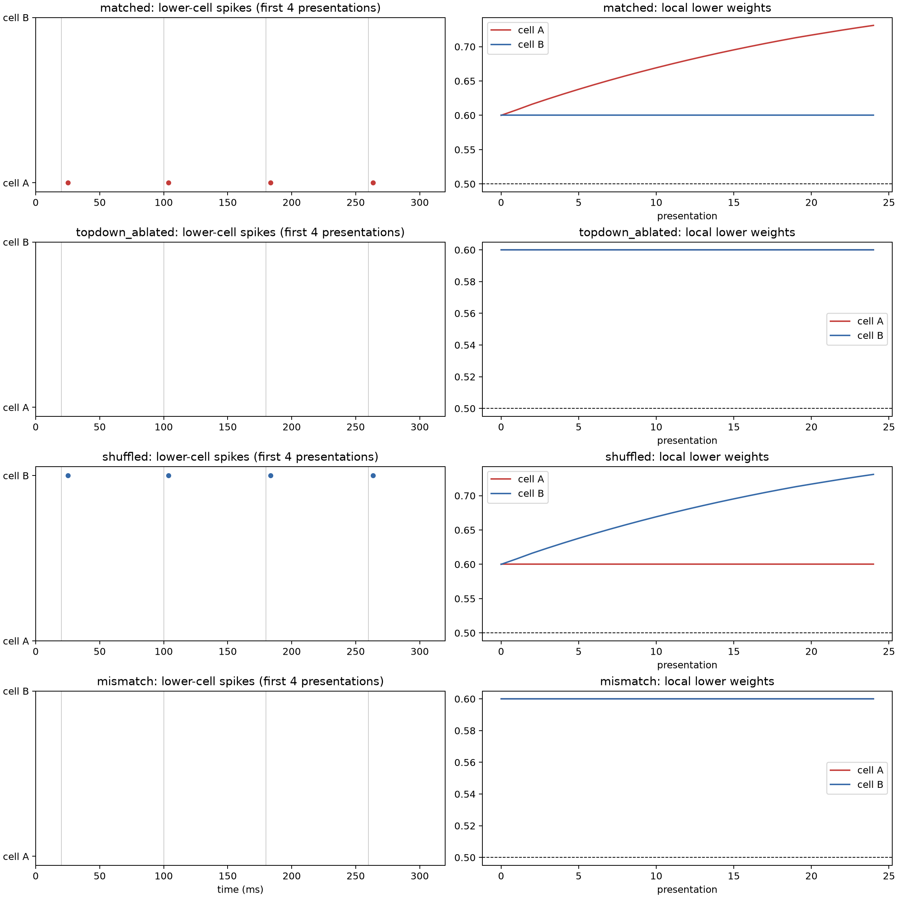
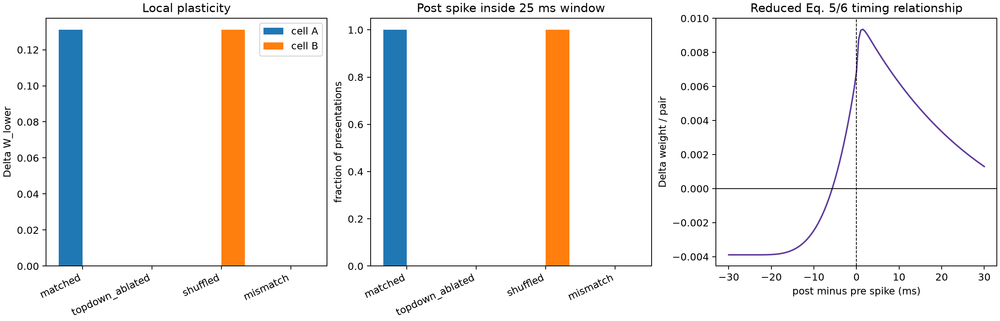
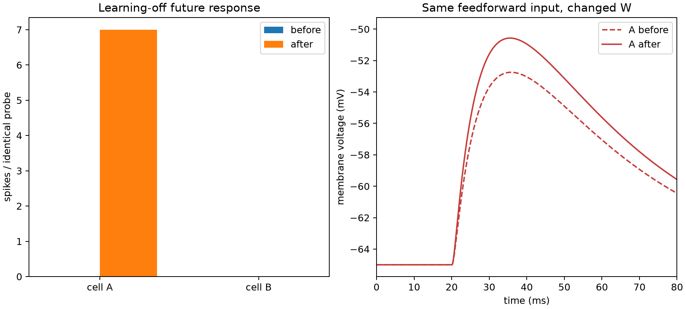

# EXP003a results

## Decision

**Outcome A — VALIDATED, at the level of the explicitly reduced motif.** All ten
documented final-development gates passed in `development_v3`. These gates were
not preregistered before every calibration run. The result validates the
narrow arrow needed for a later experiment:

\[
\text{supplied top-down match}
\rightarrow\text{local voltage/spike timing}
\rightarrow\text{SMART-derived Eq. 5/6 plasticity}
\rightarrow\text{future response}.
\]

It does not validate full SMART, pART, learned expectancy formation, reward-based
credit assignment, or a Francioni-like BCI account.

## Matched, competitor, mismatch, and ablation results

| Condition / cell | Training spikes | Mean first latency after feedforward | STDP-window occupancy | \(\Delta W\) | Future feedforward-only spikes, before → after |
|---|---:|---:|---:|---:|---:|
| Matched center (cell 0) | 29 | 3.185 ms | 1.000 | +0.1310 | 0 → 7 |
| Matched competitor (cell 1) | 0 | — | 0.000 | 0.0000 | 0 → 0 |
| Top-down ablated, max cell | 0 | — | 0.000 | 0.0000 | 0 → 0 |
| Shuffled center (cell 1) | 29 | 3.185 ms | 1.000 | +0.1310 | 0 → 7 |
| Shuffled competitor (cell 0) | 0 | — | 0.000 | 0.0000 | 0 → 0 |
| Mismatch, max cell | 0 | — | 0.000 | 0.0000 | 0 → 0 |

All weights began at 0.60. The matched center ended at 0.7310. The learning-off
future probe then made that cell spike on seven of eight identical feedforward
presentations, with mean latency 9.893 ms. The unchanged 0.60 weight never caused
a probe spike. Thus the later response was not a lingering top-down or motor
signal; top-down input was absent during both probes.

Top-down input alone produced zero lower-cell spikes in the four-millisecond
interval before feedforward input. The surround interneuron spiked 72 times in
matched and shuffled training. The reset interneuron spiked 96 times in mismatch
training. No branch disabled learning: mismatch suppressed the postsynaptic spike,
so the same local Eq. 5/6 rule received no post-spike timing state and produced
zero update.

The 29 matched-cell spikes across 24 presentations reflect occasional additional
spikes after the learned weight grew. Window occupancy and latency use the first
post-feedforward spike per presentation.

## Timing relationship

The single-pair curve generated by the same local integrator is biphasic:

| Post minus pre | \(\Delta W\) |
|---:|---:|
| -30 ms | -0.00389 |
| -10 ms | -0.00246 |
| 0 ms | +0.00686 |
| +5 ms | +0.00804 |
| +10 ms | +0.00621 |
| +20 ms | +0.00335 |
| +30 ms | +0.00130 |

This qualitatively matches the relevant SMART prediction: post-before-pre timing
relaxes the initial weight toward baseline, whereas overlap between presynaptic
conductance and the post-spike timing state yields potentiation. It is not claimed
as a quantitative reproduction of SMART Figure 6a.

## Mechanistic figures

## Development record

- `development_v1` is preserved but invalidated: its Brian2 feedforward waveform
  was a single exponential while the offline Eq. 5 integrator used a
  dual-exponential conductance.
- `development_v2` corrected the shared conductance and passed the gates, but its
  JSON serialized missing latencies as non-standard `NaN` and did not explicitly
  classify top-down input as modulatory.
- `development_v3` is the canonical checkpoint. It uses one shared normalized
  dual-exponential feedforward conductance, standards-compliant JSON, and all ten
  explicit gates.

Raw arrays, voltage/conductance traces, spike times, local plasticity traces,
summaries, and figures for all three runs are under `results/exp003a/`. See
[FAILURES.md](FAILURES.md) and [PARAMETER_LOG.md](PARAMETER_LOG.md) rather than
interpreting only the successful run.

## Interpretation and limits

The neuron specificity arose because the supplied top-down center changed lower
cell voltage and spike timing. Eq. 5/6 saw only the resulting local pre/post
history. The shuffled condition moved the entire effect to the other neuron,
ruling out a fixed index advantage. Updated feedforward conductance then changed
the later response with top-down and learning off.

The strongest limitation is the reduced postsynaptic gate
\(f_G=f_N^2\). It preserves spike-timing dependence but is not SMART's exact raw
\(V_k^2\) compartment gate. Other major reductions are LIF rather than
multi-compartment Hodgkin–Huxley neurons, supplied rather than learned top-down
expectation, explicit supplied mismatch, no gamma/beta dynamics, and parameters
calibrated for this deterministic motif.

Accordingly, the warranted conclusion is narrow: **the SMART-derived local arrow
can be implemented without a direct \(T_i\rightarrow\Delta W_i\) teaching term.**
Whether scalar outcome can learn the correct expectancy and make this mechanism
explain Francioni remains unanswered. EXP003b has not been started.
