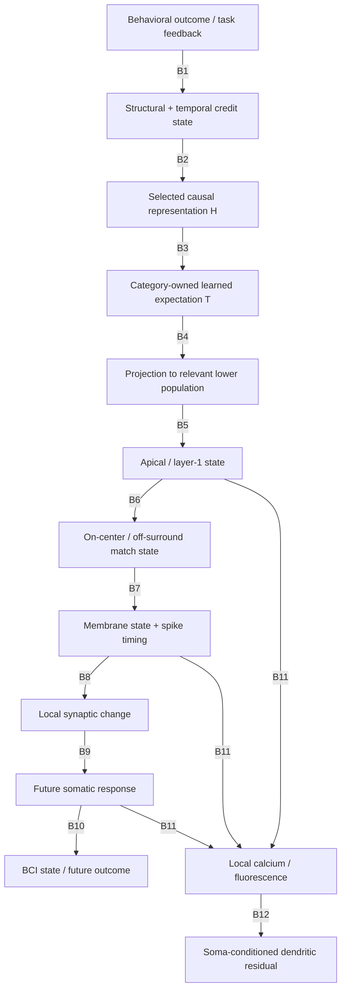

# Grossberg–Francioni bridge graph

This graph is a claim audit, not a unified model attributed to Grossberg.

The source-derived pieces are real, but the complete path is not published as one architecture. In particular, B3–B6 bind pART, ART, SMART, RSC anatomy, and the Francioni measurement into a composition that must be tested rather than assumed.

## Arrow ledger

| ID | Source → target | Proposed mechanism | Primary source / equation or circuit | Original system | Classification | Necessary? | Test and falsifier |
|---|---|---|---|---|---|---|---|
| B1 | Outcome → structural/temporal credit state | Outcome/reinforcement modulates an eligible causal trace maintained across delay | pART §§ on structural/temporal credit, working memory, incentive motivation, and Now Print; [Grossberg 2018](https://doi.org/10.1177/2398212818772179) | Prefrontal–limbic–basal-ganglia pART composition | **EXPLICITLY GROSSBERG-DERIVED** at representation level | Yes | Delay outcome while inserting distractors; eliminate the maintained trace. Falsified for this use if credit remains cell- and cause-specific without the trace or if the trace never predicts selected H. |
| B2 | Credit state → selected H | Competition, reinforcement, and ART search favor a predictive representation | pART credit-assignment account and ART resonance/reset; [Grossberg 2018](https://doi.org/10.1177/2398212818772179) | pART/ART | **EXPLICITLY GROSSBERG-DERIVED** in abstraction | Yes | Decode/perturb H across delayed outcomes. Falsified if learning is independent of the purported causal representation. |
| B3 | H → learned T | Active higher category learns the coactive lower pattern as a top-down expectation/outstar | ART top-down expectation; [Carpenter & Grossberg 1987](https://doi.org/10.1364/AO.26.004919); outstar, [Grossberg 1972](https://sites.bu.edu/steveg/files/2016/06/Gro1972MathBioSci_I.pdf); SMART top-down learning, [Grossberg & Versace 2008](https://sites.bu.edu/steveg/files/2016/06/GroVer2008BR.pdf) | ART category learning; SMART V2→V1 | **CROSS-SYSTEM EXTRAPOLATION** when H is pART causal H and targets are BCI cells | Yes | Track category-specific T acquisition independently of motor output. Falsified if H has no learned patterned expectancy or if T cannot acquire context-specific lower structure. |
| B4 | T → relevant lower RSC population | Learned higher-to-lower projection contacts the exact cells participating in BCI control | SMART higher L6II→lower L1/L5 pathway, [Grossberg & Versace 2008](https://doi.org/10.1016/j.brainres.2008.04.024); canonical extension, [Grossberg 2021](https://pmc.ncbi.nlm.nih.gov/articles/PMC8102731/) | Visual hierarchy; proposed canonical cortex | **NEW HYPOTHESIS** for arbitrary intermingled RSC P+/P− targets | Yes, killer | Identify and silence the source projection while imaging assigned cells. Falsified if role-related dendritic signals remain intact despite eliminating all candidate learned top-down sources. |
| B5 | Lower projection → measured apical/L1 state | Higher feedback directly excites distal apical targets and recruits local inhibition | SMART explicitly places higher feedback in lower L1 on L5 apical dendrites; Francioni manipulates L1 NDNF+ cells | SMART visual cortex versus Francioni RSC | Direct excitation is **EXPLICITLY GROSSBERG-DERIVED** in SMART; NDNF mapping is **NEW HYPOTHESIS** | Yes | Projection-specific recordings plus NDNF perturbation. Falsified if candidate axons do not reach the measured compartment or do not contribute to the residual. |
| B6 | Apical state → center/surround match state | Feedback center primes matching cells; folded/local circuits suppress competitors | SMART laminar loop and canonical “two-against-one” circuit; [Grossberg & Versace 2008](https://doi.org/10.1016/j.brainres.2008.04.024), [Grossberg 2021](https://pmc.ncbi.nlm.nih.gov/articles/PMC8102731/) | Visual cortical/thalamic matching | **EXPLICITLY GROSSBERG-DERIVED** as a circuit motif; arbitrary behavioral sign is **NEW HYPOTHESIS** | Yes for signed-selection account | Separately measure excitatory feedback and inhibitory surround. Falsified if opponent cell roles are not represented in either component or if surround is spatially too coarse. |
| B7 | Match state → membrane/spike timing | Match increases gain/synchrony; mismatch delays, suppresses, or resets activity | SMART spiking simulations and gamma-match/beta-mismatch dynamics; [Grossberg & Versace 2008](https://sites.bu.edu/steveg/files/2016/06/GroVer2008BR.pdf) | SMART LGN–V1–pulvinar–V2 | **EXPLICITLY GROSSBERG-DERIVED** | Yes | Intracellular/spike timing under match, wrong feedback, and ablation. Falsified if feedback does not alter local timing in the required cells. |
| B8 | Timing → local ΔW | Presynaptic conductance and postsynaptic voltage/spike timing gate bounded local plasticity | SMART Eq. 5 plus Eq. 6 voltage/spike gate; [Grossberg & Versace 2008](https://sites.bu.edu/steveg/files/2016/06/GroVer2008BR.pdf) | SMART adaptive filters/top-down learning | **EXPLICITLY GROSSBERG-DERIVED** locally | Yes | Measure local timing, synaptic change, and timing perturbation. Falsified if appropriate timing does not cause the predicted local change. EXP003a validated only this reduced arrow. |
| B9 | ΔW → future soma | Changed conductance alters subsequent membrane response/spiking | Consequence of SMART conductance-based synapses; [Grossberg & Versace 2008](https://sites.bu.edu/steveg/files/2016/06/GroVer2008BR.pdf) | SMART | **EXPLICITLY GROSSBERG-DERIVED** and **GENERIC NEUROBIOLOGY** | Yes | Freeze learning and replay identical input. Falsified if measured ΔW has no future-response consequence. |
| B10 | Future soma → BCI state/outcome | Experimenter's decoder maps selected neuronal activity to visual state and reward | [Francioni et al. 2026](https://doi.org/10.1038/s41586-026-10190-7) | Experimental BCI | **SOURCE-DERIVED** experimental contingency, not Grossberg | Yes behaviorally | Replay/causal perturbation. This arrow is fixed by task design. |
| B11 | Apical/timing/soma state → calcium fluorescence | Voltage, local spikes/plateaus, synaptic currents, backpropagating spikes, inhibition, indicator kinetics jointly generate fluorescence | Francioni Methods; distal-dendrite physiology: [Jiang et al. 2013](https://doi.org/10.1038/nn.3305), [Beaulieu-Laroche et al. 2019](https://pmc.ncbi.nlm.nih.gov/articles/PMC6639136/) | Biological dendrite and optical measurement | **GENERIC NEUROBIOLOGY**, but the required forward model is a **NEW HYPOTHESIS** | Yes for measurement-level explanation | Simultaneous voltage/current/calcium calibration. Falsified if the proposed cellular state cannot generate the observed optical statistic. |
| B12 | Fluorescence → D residual | Linear soma conditioning isolates relative dendritic amplification/attenuation | Francioni analysis and Methods, [Francioni et al. 2026](https://doi.org/10.1038/s41586-026-10190-7) | Experimental analysis | **SOURCE-DERIVED** statistic; mechanistic interpretation remains **INFERENCE** | Yes for reproducing the reported result | Apply the preregistered analysis to a calibrated forward model. Falsified for a model if role information is systematically removed or a matched residual cannot be recovered. |

## Where the published theory ends

The most defensible source-derived subchains are:

1. pART: outcome/feedback → maintained causal trace → representation selection.
2. ART/SMART: active category + lower coactivity → learned top-down expectation.
3. SMART: supplied learned expectation → match-dependent membrane timing → local plasticity → altered future response.
4. Francioni: L5 activity → externally defined BCI state → outcome; dendritic calcium residual is role-related and predicts later change.

The central unprovided bridge is:

\[
H_{\text{pART}}
\xrightarrow{\text{not specified for this system}}
T_{k,i}^{\text{RSC, arbitrary role}}
\xrightarrow{\text{not established}}
\text{NDNF/L1 opponent signal with correct plasticity sign}.
\]

EXP003a tested B7–B9 in a reduced SMART-derived motif. EXP003b primarily tested an engineered B2–B6 composition plus a synthetic B11–B12 observation model; its failure cannot be promoted into a verdict on ART, pART, or SMART globally.
